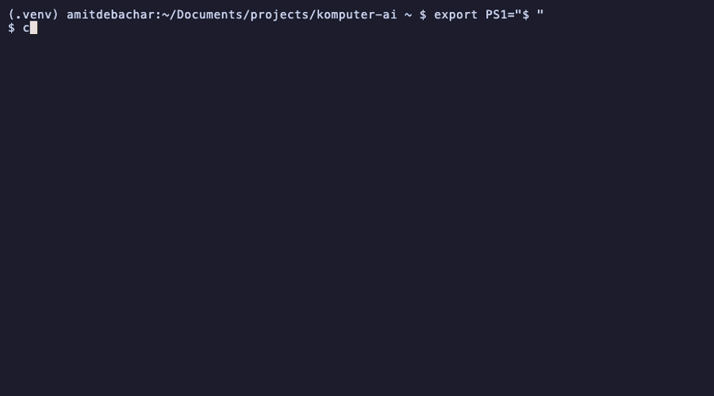
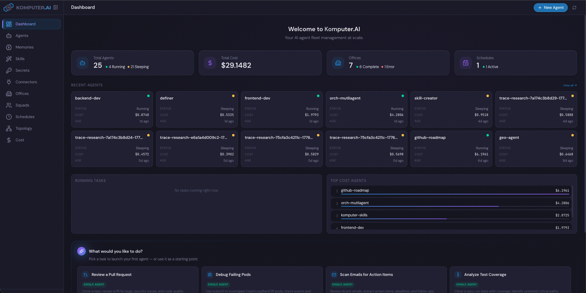
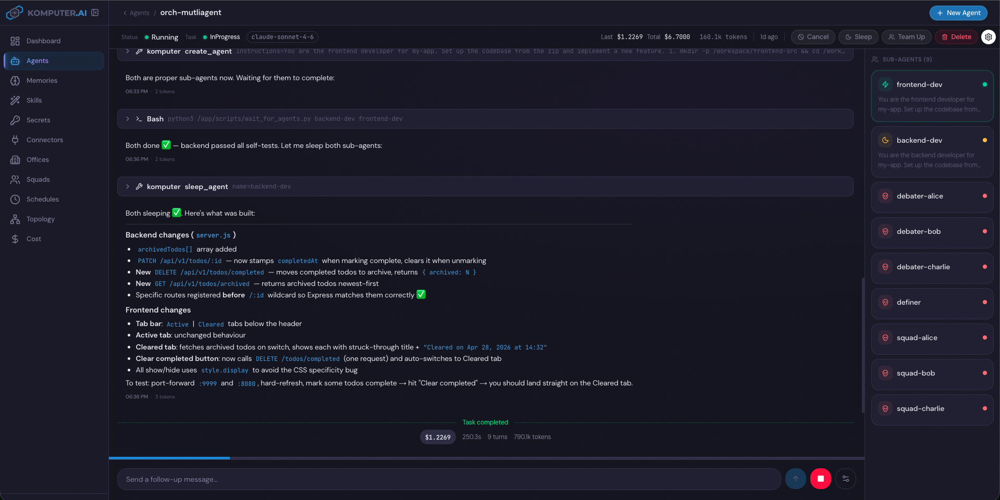

<p align="center">
  
</p>

<h1 align="center">Komputer.AI</h1>

<p align="center">
  <strong>Distributed Claude AI agents on Kubernetes</strong>
</p>

<p align="center">
  <a href="https://github.com/komputer-ai/komputer-ai/blob/main/LICENSE"></a>
  <a href="https://go.dev/"></a>
  <a href="https://www.python.org/"></a>
  <a href="https://kubernetes.io/"></a>
  <a href="https://www.anthropic.com/"></a>
</p>

<p align="center">
  A stateless, Kubernetes-native platform for running persistent Claude AI agents.<br/>
  Built on CRDs, operators, and the Kubernetes API — agents are first-class cluster resources.<br/>
  Designed to be driven by external systems. Create agents, send tasks, and stream real-time results via REST + WebSocket.
</p>

<p align="center">
  
</p>

<p align="center">
  
</p>

<p align="center">
  
</p>

## Python SDK

```bash
pip install komputer-ai-sdk
```

```python
from komputer_ai.client import KomputerClient

client = KomputerClient("http://localhost:8080")

# Create an agent and give it a task
client.create_agent(
    name="my-agent",
    instructions="Analyze our Kubernetes cluster and suggest cost optimizations",
    model="claude-sonnet-4-6",
)

# Stream events as the agent works
for event in client.watch_agent("my-agent"):
    if event.type == "text":
        print(event.payload.content)
    elif event.type == "tool_use":
        print(f"  -> using {event.payload.name}")
    elif event.type == "task_completed":
        print(f"\nDone — cost: ${event.payload.cost_usd}")
        break
```

Full SDK reference in [komputer-sdk/](komputer-sdk/).

---

## Key Features

- **Persistent agents** — each agent runs in its own pod with a persistent workspace that survives restarts and sleep cycles
- **Manager/worker orchestration** — managers create and coordinate sub-agents, delegate tasks, and synthesize results
- **Steer mid-task** — send follow-up messages to a running agent without restarting, seamlessly redirecting its work
- **MCP connectors** — connect agents to external tools (Slack, GitHub, Atlassian, Notion, Google Workspace) via OAuth or token auth
- **Skills and memories** — attach reusable knowledge and capabilities to agents as Kubernetes CRDs
- **Custom system prompts** — configure agent behavior, persona, and constraints separately from task instructions
- **Per-agent overrides** — override resources, image, or PVC size on a single agent without forking a new template; managers can also patch sub-agents at runtime via the `update_agent` tool
- **Concurrency control** — cap how many agents per template can run at once with `maxConcurrentAgents`; excess agents are queued and admitted in priority order
- **Scheduling** — cron-based recurring tasks with timezone support and auto-cleanup
- **Cost tracking and analysis** — real-time cost per task, context window monitoring, per-agent cost breakdown with task-level drill-down
- **Session history resilience** — if Redis is wiped, full conversation history is recovered from the agent's session data with proper event conversion
- **SDKs for Python, Go, and TypeScript** — create agents, send tasks, and stream results with a few lines of code
- **CLI, UI, and API** — manage everything from the terminal, browser, or programmatically

---

## Components

| Component | Language | Description |
|-----------|----------|-------------|
| [komputer-operator](komputer-operator/) | Go | Kubernetes operator that manages agent lifecycle — creates pods, PVCs, and config for each agent |
| [komputer-api](komputer-api/) | Go | REST + WebSocket API for creating agents, listing status, and streaming real-time events |
| [komputer-agent](komputer-agent/) | Python | The agent runtime — runs Claude with bash/web tools in a persistent workspace |
| [komputer-cli](komputer-cli/) | Go | Beautiful CLI for interacting with the platform |
| [komputer-ui](komputer-ui/) | TypeScript | Web dashboard for managing agents, offices, schedules, memories, skills, connectors, and costs |
| [komputer-sdk](komputer-sdk/) | Python, Go, TypeScript | Typed SDKs for the REST API + WebSocket streaming |


## Documentation

1. [Concepts](docs/concepts.md) — Agents, templates, config, secrets, namespaces — how the system fits together
2. [Installation](#installation) — Deploy to any Kubernetes cluster in minutes
3. [Integration Guide](docs/integration-guide.md) — How to connect external systems via HTTP API and WebSocket events
4. [Custom Agent Images](docs/custom-agent-image.md) — Build custom agent images with your own packages and tools
5. [Local Development](docs/local-development.md) — Build and run from source on a local cluster
6. [Examples](examples/) — 10 end-to-end examples: hello world, secrets, managers, schedules, CI/CD, Slack, and more
7. [Architecture](#architecture) — System diagram and component interactions
8. Komputer Components
   1. [komputer-api](komputer-api/README.md) — REST & WebSocket API reference, Swagger UI, configuration
   2. [komputer-operator](komputer-operator/README.md) — CRD definitions, reconciliation logic, operator development guide
   3. [komputer-agent](komputer-agent/README.md) — Agent runtime, Claude SDK integration, manager tools, event format
   4. [komputer-cli](komputer-cli/README.md) — CLI commands, flags, usage examples
   5. [komputer-ui](komputer-ui/README.md) — Web dashboard, pages, configuration, development
   6. [komputer-sdk](komputer-sdk/README.md) — Python, Go, TypeScript SDKs, generation pipeline, testing
   7. [Helm Chart](helm/komputer-ai/README.md) — Chart values, custom installation, external Redis

## Installation

### Prerequisites

- Kubernetes cluster (Docker Desktop, kind, minikube, EKS, GKE, etc.)
- `kubectl` configured
- `helm` 3.x installed
- An [Anthropic API key](https://console.anthropic.com/)

### 1. Create the Anthropic API key secret

```bash
kubectl create namespace komputer-ai
kubectl create secret generic anthropic-api-key \
  --from-literal=api-key=sk-ant-... \
  -n komputer-ai
```

> **Note:** If you deploy agents to namespaces other than `komputer-ai`, you must create the Anthropic API key secret in each of those namespaces too:
> ```bash
> kubectl create secret generic anthropic-api-key \
>   --from-literal=api-key=sk-ant-... \
>   -n <your-namespace>
> ```
> Agents cannot start without this secret in their namespace.

### 2. Install with Helm

```bash
helm install komputer-ai oci://ghcr.io/komputer-ai/charts/komputer-ai \
  --set anthropicApiKeySecret.name=anthropic-api-key \
  --namespace komputer-ai
```

This deploys the operator, API, Redis, CRDs, and a default agent template — everything you need.

### 3. Install the CLI

Download from [GitHub Releases](https://github.com/komputer-ai/komputer-ai/releases):

```bash
# macOS (Apple Silicon)
curl -L https://github.com/komputer-ai/komputer-ai/releases/latest/download/komputer-darwin-arm64 -o komputer
chmod +x komputer && sudo mv komputer /usr/local/bin/

# Linux (amd64)
curl -L https://github.com/komputer-ai/komputer-ai/releases/latest/download/komputer-linux-amd64 -o komputer
chmod +x komputer && sudo mv komputer /usr/local/bin/
```

### 4. Connect and run your first agent

```bash
# Port-forward the API and UI (or use an Ingress)
kubectl port-forward svc/komputer-ai-api 8080:8080 -n komputer-ai &
kubectl port-forward svc/komputer-ai-ui 3000:3000 -n komputer-ai &

# Open the dashboard
open http://localhost:3000

# Or use the CLI
komputer login http://localhost:8080
komputer run my-agent "Write a haiku about Kubernetes"
```

For custom installation options (external Redis, resource limits, etc.), see the [Helm Chart docs](helm/komputer-ai/README.md). For building from source, see [Local Development](docs/local-development.md).

## Custom Resources

For a conceptual overview of these resources, see [Concepts](docs/concepts.md).

**KomputerConfig** (cluster-scoped, singleton) — Platform configuration with Redis and API settings:
```yaml
apiVersion: komputer.komputer.ai/v1alpha1
kind: KomputerConfig
metadata:
  name: default
spec:
  redis:
    address: "redis.default:6379"
    db: 0
    streamPrefix: "komputer-events"
    passwordSecret:
      name: redis-secret
      key: password
  apiURL: "http://komputer-api.default.svc.cluster.local:8080"
```

**KomputerAgentClusterTemplate** (cluster-scoped) — Reusable pod configuration shared across all namespaces:
```yaml
apiVersion: komputer.komputer.ai/v1alpha1
kind: KomputerAgentClusterTemplate
metadata:
  name: default
spec:
  maxConcurrentAgents: 0   # 0 = no cap; set >0 to queue excess agents
  podSpec:
    containers:
      - name: agent
        image: komputer-agent:latest
        resources:
          limits:
            cpu: "2"
            memory: "2Gi"
  storage:
    size: "5Gi"
```

**KomputerAgentTemplate** (namespaced) — Namespace-scoped pod configuration. Takes precedence over a cluster template with the same name.

**KomputerAgent** — An agent instance with Claude configuration:
```yaml
apiVersion: komputer.komputer.ai/v1alpha1
kind: KomputerAgent
metadata:
  name: my-agent
spec:
  instructions: "Research quantum computing and write a summary"
  systemPrompt: "You are a scientific researcher. Always cite sources."  # optional
  model: "claude-sonnet-4-6"
  templateRef: "default"
  role: "manager"    # or "worker" — managers get orchestration tools
  lifecycle: "Sleep" # "", "Sleep", or "AutoDelete"
  priority: 0        # higher = admitted first when template's maxConcurrentAgents is reached
  secrets:           # optional list of K8s Secret names
    - my-agent-secrets
  # Optional per-agent overrides — merged into the template at pod build time
  podSpec:
    containers:
      - name: agent
        resources:
          requests: { cpu: "4", memory: "8Gi" }
          limits:   { cpu: "4", memory: "8Gi" }
  storage:
    size: 50Gi       # expands existing PVC in place when StorageClass supports it
```

**KomputerOffice** — Tracks a group of agents under a manager. Created automatically when managers create sub-agents.

**KomputerSchedule** — Runs agent tasks on a cron schedule with timezone support, auto-delete, and cost tracking.

**KomputerMemory** — A persistent knowledge resource attached to agents. Memory content is injected into the agent's system prompt so Claude has it as context on every task:
```yaml
apiVersion: komputer.komputer.ai/v1alpha1
kind: KomputerMemory
metadata:
  name: k8s-runbook
spec:
  description: "Kubernetes runbook for production cluster"
  content: |
    ## Production Cluster Runbook
    - Always drain nodes before maintenance
    - Use `kubectl rollout restart` instead of deleting pods
```

Attach to an agent in its spec:
```yaml
spec:
  memories:
    - k8s-runbook
```

**KomputerSkill** — A reusable skill written to the agent's filesystem as a Claude SDK skill file. Skills appear as slash commands the agent can invoke:
```yaml
apiVersion: komputer.komputer.ai/v1alpha1
kind: KomputerSkill
metadata:
  name: python-expert
spec:
  description: "Expert Python code review and best practices"
  content: |
    When reviewing Python code:
    - Check for PEP 8 compliance
    - Look for common security issues
    - Suggest type hints where missing
```

Attach to an agent in its spec:
```yaml
spec:
  skills:
    - python-expert
```

**KomputerConnector** — A named MCP (Model Context Protocol) server connection. Connectors give agents access to external tools like GitHub, Slack, Linear, and any custom MCP endpoint:
```yaml
apiVersion: komputer.komputer.ai/v1alpha1
kind: KomputerConnector
metadata:
  name: github
spec:
  service: github
  url: "https://api.githubcopilot.com/mcp/"
  authSecretKeyRef:
    name: github-credentials
    key: token
```

Attach to an agent in its spec:
```yaml
spec:
  connectors:
    - github
```

## CLI Usage

```bash
komputer login <endpoint>           # Save API endpoint
komputer create <name> <prompt>     # Create agent or send task
komputer run <name> <prompt>        # Create + stream output live
komputer chat <name>                # Interactive turn-by-turn conversation
komputer update <name>              # Patch an existing agent (model, resources, etc.)
komputer list [--status queued]     # List all agents (optionally filter by phase)
komputer get <name>                 # Get agent details + recent events
komputer watch <name>               # Stream live events (WebSocket)
komputer cancel <name>              # Cancel running task
komputer delete <name> [name...]    # Delete one or more agents

# Flags
--api <url>                         # Override saved endpoint
--model <model>                     # Override Claude model per task
-n, --namespace <ns>                # Target Kubernetes namespace
--secret KEY=VALUE                  # Pass secrets (repeatable)
--memory <name>                     # Attach a KomputerMemory (repeatable)
--skill <name>                      # Attach a KomputerSkill (repeatable)
--connector <name>                  # Attach a KomputerConnector (repeatable)
--system-prompt <text>              # Custom system prompt for the agent
--priority <int>                    # Queue priority (higher = admitted first; default 0)
--cpu <quantity>                    # Override agent container CPU (e.g. 2 or 500m)
--memory-limit <quantity>           # Override agent container memory (e.g. 4Gi)
--storage <size>                    # Override PVC size (e.g. 20Gi)
--image <image>                     # Override agent container image
```

### Secrets

Pass credentials to agents at creation time. Secrets are stored as K8s Secrets and injected as `SECRET_*` env vars:

```bash
# Single secret
komputer run github-bot "create a PR" --secret GITHUB=ghp_xxx

# Multiple secrets
komputer run deploy-agent "deploy to prod" \
  --secret GITHUB=ghp_xxx \
  --secret SLACK=xoxb-xxx \
  --secret AWS_KEY=AKIA...

# Agent sees: SECRET_GITHUB, SECRET_SLACK, SECRET_AWS_KEY as env vars
```

The agent is instructed to check `SECRET_*` env vars when credentials are needed. If a required secret is missing, the agent completes what it can and reports which credential is needed.

## How It Works

1. **Create** — CLI/API creates a `KomputerAgent` CR in Kubernetes
2. **Reconcile** — Operator detects the CR, creates a PVC (persistent workspace) and Pod
3. **Execute** — Agent pod starts, runs Claude with the given instructions
4. **Stream** — Agent publishes structured events to Redis (tool calls, messages, results)
5. **Consume** — API worker reads events, updates CR status (`InProgress`/`Complete`), and dispatches via WebSocket — either broadcast to all subscribers or queue-routed via consumer groups (`?group=` query param) for distributed deployments. See the [integration guide](docs/integration-guide.md#delivery-modes-broadcast-vs-consumer-group)
6. **Persist** — Agent pod stays running after task completion, accepting new tasks via FastAPI

### Event Types

Events published by agents and streamed via WebSocket:

| Type | Description | Payload |
|------|-------------|---------|
| `task_started` | Agent begins a task | `{instructions}` |
| `thinking` | Claude's reasoning | `{content}` |
| `tool_call` | Tool invocation | `{id, tool, input}` |
| `tool_result` | Tool execution result | `{tool, input, output}` |
| `text` | Claude's text response | `{content}` |
| `task_completed` | Task finished | `{result, cost_usd, duration_ms, turns}` |
| `task_cancelled` | Task was cancelled | `{reason}` |
| `error` | Error occurred | `{error}` |

## Architecture

```
              ┌──────────────┐  ┌──────────────┐
              │ komputer-cli │  │ komputer-ui  │
              └──────┬───────┘  └──────┬───────┘
                     └────────┬────────┘
                              │
                    ┌─────────▼───────┐
                    │  komputer-api   │
                    │  (Go / Gin)     │
                    │                 │
                    │  REST + WS API  │───── Creates KomputerAgent CRs
                    │  Redis worker   │◄──── Consumes agent events
                    └─────────────────┘
                             │
              ┌──────────────┼──────────────┐
              │              │              │
    ┌─────────▼──────┐  ┌───▼────┐  ┌──────▼──────────┐
    │ AgentTemplate  │  │ Redis  │  │ KomputerAgent   │
    │ ClusterTemplate│  │        │  │ (manager/worker)│
    └─────────┬──────┘  └───▲────┘  └──────┬──────────┘
              │              │              │
       ┌──────▼──────────────┼──────────────┘
       │ komputer-operator   │
       │ (Go / operator-sdk) │
       │                     │
       │ Reconciles CRs →    │
       │ creates Pods + PVCs │
       └──────────┬──────────┘
                  │
       ┌──────────▼──────────┐
       │ Agent Pod           │
       │ (Python / Claude)   │
       │                     │
       │ Bash + Web Search   │──── Events → Redis
       │ PVC at /workspace   │
       │ FastAPI on :8000    │
       └─────────────────────┘
```

## Project Structure

```
komputer-ai/
├── komputer-operator/     # K8s operator (Go, operator-sdk)
│   ├── api/v1alpha1/      # CRD types (Config, Agent, Templates)
│   ├── internal/          # Controller logic
│   └── config/            # RBAC, CRDs, samples
├── komputer-api/          # HTTP + WebSocket API (Go, Gin)
│   ├── handler.go         # REST endpoints
│   ├── worker.go          # Redis event consumer
│   └── ws.go              # WebSocket hub
├── komputer-agent/        # Agent runtime (Python)
│   ├── agent.py           # Claude Agent SDK integration
│   ├── server.py          # FastAPI task endpoint
│   └── events.py          # Redis event publisher
├── komputer-cli/          # CLI (Go, Cobra + Lipgloss)
│   └── main.go            # All commands in one file
└── docs/                  # Design specs and plans
```

## License

[MIT](LICENSE)
